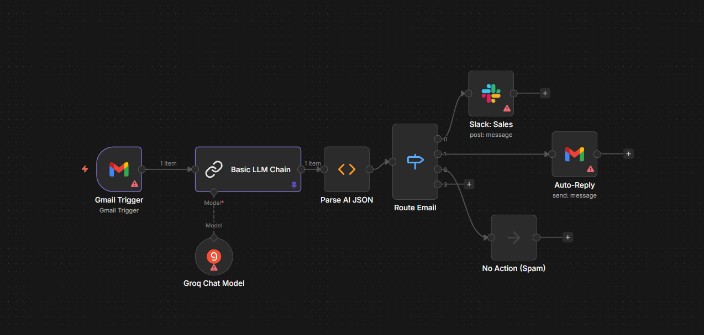

# n8n AI Email Routing

An automated email triage and support workflow for [n8n](https://n8n.io/) that uses an LLM to smartly classify incoming emails. Depending on the content, the workflow routes the email to Slack (for Sales), auto-replies to the sender (for Support), or takes no action (for Spam).

## Overview
When an email arrives, this workflow:
1. Triggers via the Gmail node.
2. Extracts the email content and passes it to an LLM (LangChain via Groq).
3. Classifies the email into categories: `Sales`, `Support`, `Spam`, or `Other`.
4. Uses a Switch node to route the parsed content:
   - **Sales**: Sends a formatted alert to a specified Slack channel.
   - **Support**: Automatically sends an auto-reply back to the sender via Gmail.
   - **Spam**: Takes no action (No-Op node).

## Prerequisites
Before you begin, ensure you have the following:
- An active [n8n](https://n8n.io/) instance (Cloud or Self-Hosted).
- A Google account to configure the Gmail App trigger and actions.
- A [Groq](https://groq.com/) account for the API key to use the Llama-3.1 model.
- A Slack workspace to configure incoming webhooks for the Sales alerts.

## Setup Instructions

### 1. Import the Workflow
1. Download the [`AI_Email_Triage_and_Support_Ticketing.json`](./AI_Email_Triage_and_Support_Ticketing.json) file from this repository.
2. Open your n8n workspace.
3. In the top right corner of the workflows dashboard, click **Add Workflow**.
4. Click the options menu (three dots) in the top right corner and select **Import from File...**.
5. Select the downloaded JSON file.

### 2. Configure Credentials
Once imported, you will notice several nodes requiring configuration. Click on each node to set up the corresponding credentials:

#### Gmail Nodes ("Gmail Trigger" & "Auto-Reply")
- **Authentication**: You must set up a Gmail OAuth2 credential (or App Password depending on your n8n setup).
- Follow the n8n prompt to **Create New Credential** or reuse an existing Gmail credential.

#### Groq Chat Model
- Open the "Groq Chat Model" node.
- Select the credential drop-down and create a new **Groq API** credential.
- Find or generate your API key from the [Groq Console](https://console.groq.com/keys) and enter it here.

#### Slack Node ("Slack: Sales")
- Open the Slack node.
- Connect your Slack workspace using OAuth2 or an incoming webhook token as prompted by n8n.
- Ensure you select the target `channel` or `user` to receive the notifications.

### 3. Customize and Activate
- **Review Settings**: You may want to tweak the LLM prompt inside the `Basic LLM Chain` node or change the Auto-Reply email text in the second Gmail node to better fit your use case.
- **Activate**: Once all credentials are valid (no nodes showing errors), toggle the **Active** switch at the top right of the canvas to turn the workflow on.

## How it Works Under the Hood
- **LangChain Integration**: The workflow uses LangChain nodes in n8n. The LLM is instructed to return `ONLY valid JSON`, classifying the email and extracting a summary and priority.
- **Parsing the Output**: A custom code function (`Parse AI JSON`) intercepts the raw string from the LLM and parses it into JSON format, merging it with the original email payload so the remaining nodes can process it easily.
- **Routing**: The Switch node evaluates `{{ $json.category }}` to determine the execution path.
